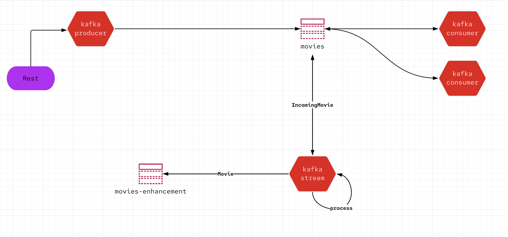

# kakfka-poc



```bash
docker compose -f ./kafka-compose.yml up

```

```bash 
$ kafka-topics.sh --bootstrap-server localhost:9092 --create --topic movies --partitions 1 --replication-factor 1

$ kafka-topics.sh --bootstrap-server localhost:9092 --create --topic movies-enhancement --partitions 1 --replication-factor 1
```


```bash
$ kcat -b localhost:9092 -t movies-enhancement -f 'key: %k\nValue: %s\nPartition: %p\n'

$ kcat -b localhost:9092 -t movies -f 'key: %k\nValue: %s\nPartition: %p\n'
```


```bash
curl localhost:8080/produce/simple

curl localhost:8080/produce/metadata
```